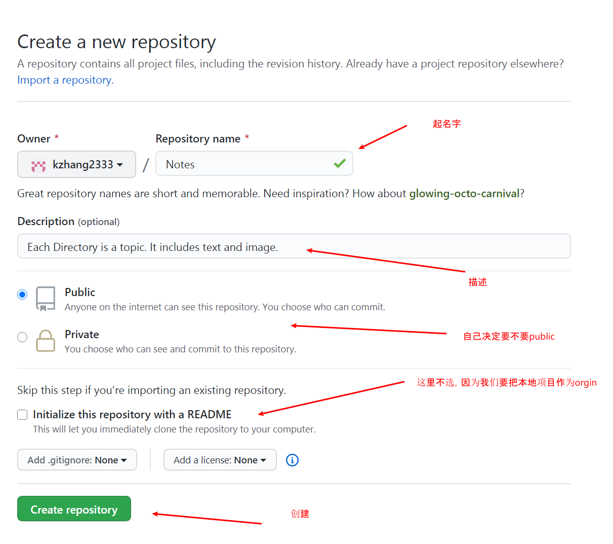
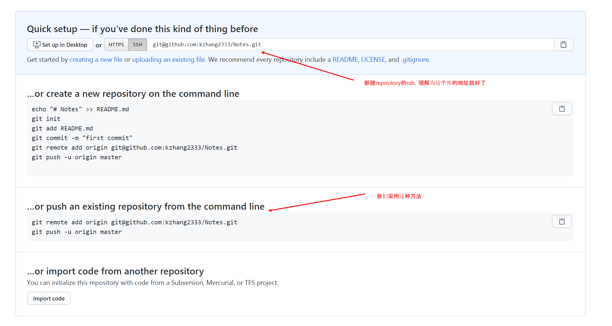
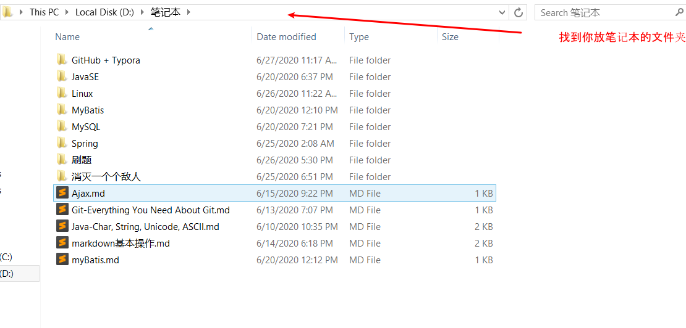
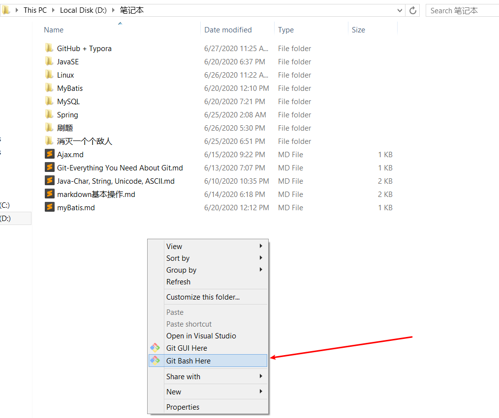
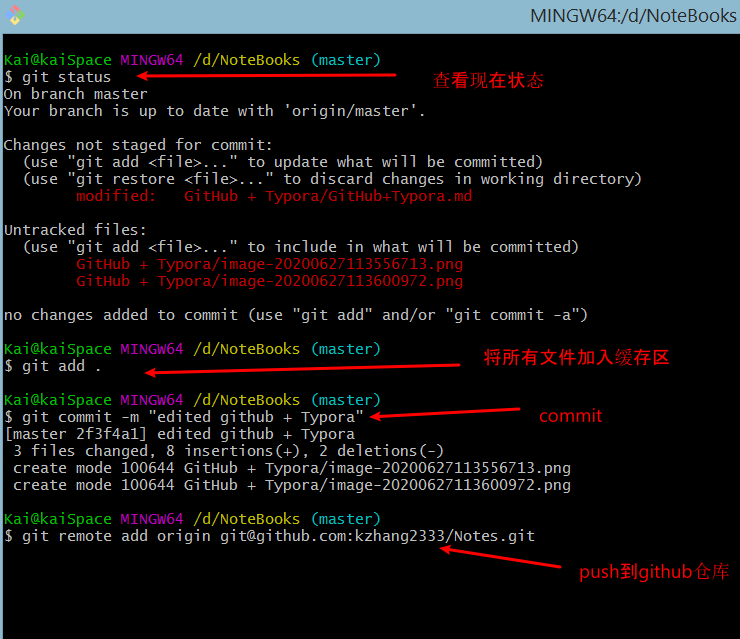
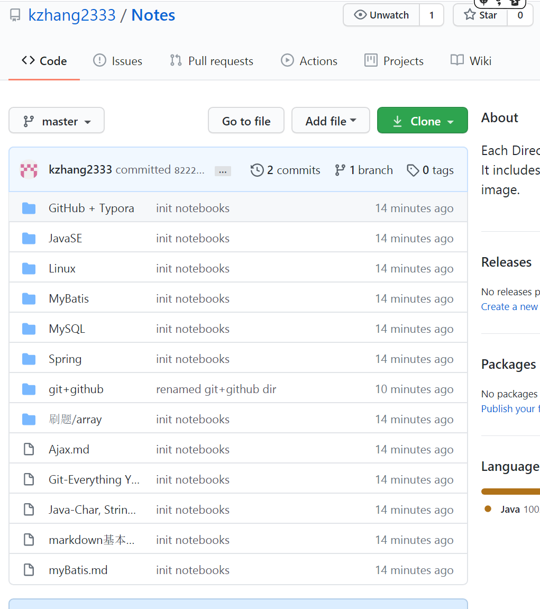

# 为什么要这样做

记笔记对于学习者来说是一件有重要意义和益处的事情，从费曼学习法的角度，记笔记的过程类似于将知识讲述给他人的过程，teaching is learning。

对于程序员，常常需要记笔记，写文档，要完成这些写作就必须使用编辑器。目前比较主流的是使用markdown语言

markdown vs word

| markdown                                     | word                             |
| -------------------------------------------- | -------------------------------- |
| 需要学习markdown语法，但深入学习成本低       | 对小白更友好，基本无需学习       |
| 格式固定，兼容性强                           | 兼容性差，有版本问题             |
| 轻量级语言，打开文件神速                     | word软件本身臃肿，大文件打开更慢 |
| 因为是纯文本文档，**可以用github做版本控制** | 富文本编辑器，无法上传至github   |
| 所见非所得，文本内包含结构体                 | 所见即所得，结构描述被隐藏       |

这里可以看到，markdown语言相对于word之类的传统文档编辑器有很多好处。但是并不是说markdown一定比word好，markdown还是有他的缺点，比如说word有更丰富的排版，炫彩的模板。只是对特定群体，markdown更好。尤其是程序员，今天我们就利用markdown为纯文本的特点来实现我们自己的“google doc“、”dropbox“。**利用github对笔记做版本控制，以达到在多机器、多个平台间的同步。**

# 准备GitHub

1. 注册GitHub账号，这里请参考GitHub教程

2. 建立一个新的仓库（Repository）专门用来存放笔记

   

3. 创建时如果选择添加README.md，可以马上将项目clone到本地；如果没选（我们这里没选），github贴心地为你准备了下一步该怎么做，我们选择第二种方法，将已经存在的本地项目push到刚刚创建的仓库里去

   

# 将本地笔记本push到github

1. 找到你放笔记的文件夹
   

2. 打开git bash

   

3. 首先将这个文件夹初始化为git管理的文件夹

   

4. 这时要注意，还不能push，因为你没有stage任何文件，也没有执行过commit操作，首先我们要用`git add .` 将所有文件加入到缓存区，然后用`git commit -m "anything you want"` 操作将缓存区的文件加入到仓库。这时我们就可以使用github上面给我们的提示啦。

   

5. 这时你回到github 仓库首页，你就会惊奇地发现，你本地的笔记都来了。

   

# 更新笔记

这时我们的github仓库就和我们的本地文件夹联系在一起了！

以后再本地更新笔记、添加新笔记、删除笔记后，只需要push到远端，即可完成更新，在其他机器上，我们也只需pull最新的更改，即可获得笔记的最新版本。这里我们就不演示了。

# one more step

这时有些人要说了，这还是不方便啊，每次写前需要pull，写完需要push，遇到conflict需要attention，和google doc不一样啊。

确实，正如使用markdown和word的区别一样，这种方法确实有一点点门槛。但是我们可以go one more step，利用脚本进行自动化同步，不过这不在今天的主题之内（todo），[我们主要参考了这边博文](https://juejin.im/post/5e6ae645e51d4527235b7658) 