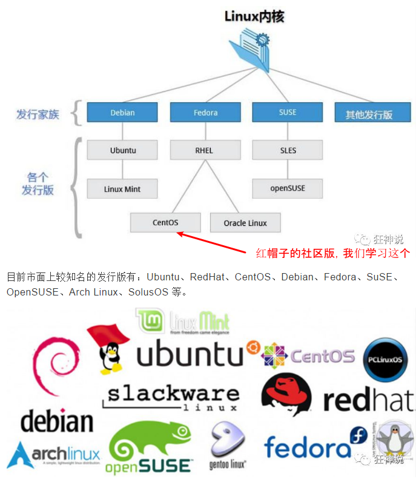
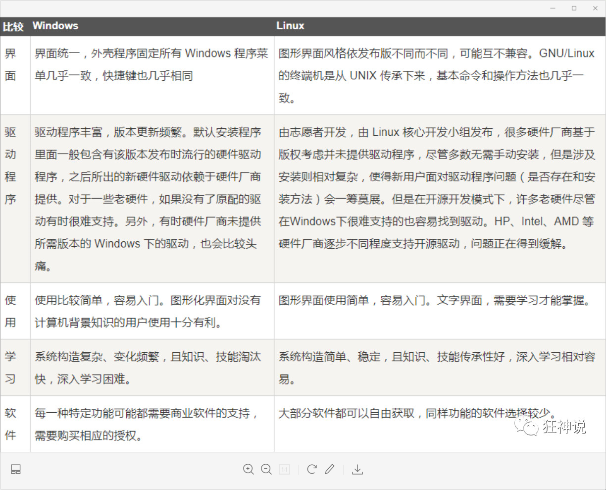
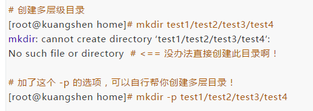
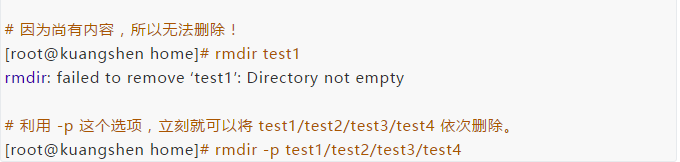
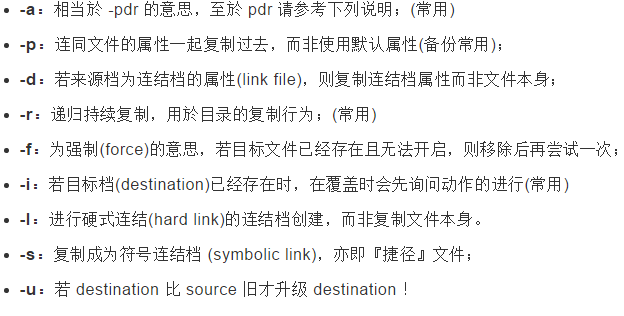
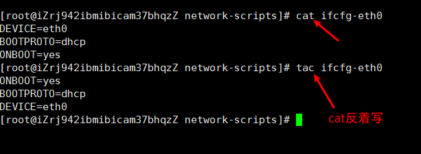
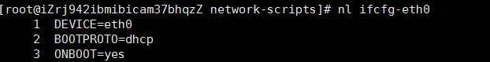
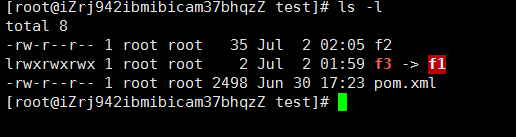
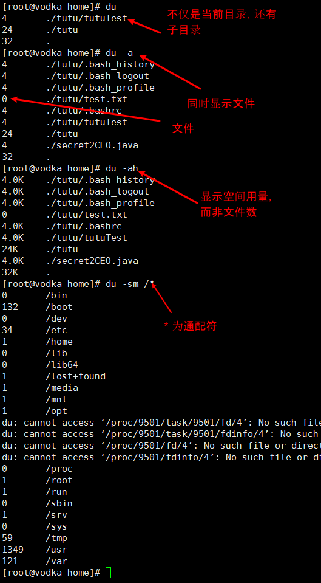

# 0. Intro to Linux

## Linux是什么

- 芬兰人林纳斯·托瓦兹（Linus Torvalds）在赫尔辛基大学时出于**个人爱好**编写的
- Linux是一套**免费**和**自由传播**的**类Unix操作系统**， “是一个基于 POSIX（可移植操作系统接口） 和 UNIX 的多用户、多任务、支持多线程和多 CPU 的操作系统。”
- 以网络为核心
- 性能稳定，多用户

## Linux发行版本

Linux 的发行版说简单点就是将 Linux 内核与应用软件做一个打包。

Kali - 黑客专用，**测试安全漏洞**



## Linux可以干什么

- 对我们自己来来说，作为一个“码农”，我们会在以下领域用到Linux作为环境

  部署服务器，集群分布式，消息队列（Kafka、RabbitMQ、RocketMQ），缓存（Redis），搜索引擎（ES）

- 嵌入式设备（Raspberry PI）

- 超级计算机

- **服务器大量使用Linux，这也是我们以后最常见的应用场景**

==为什么这些事情一定要在Linux上做？== 

## Linux的优缺点

其实Linux和windows就是在因为目标不同，在工程上做了不同的取舍，Windows面向普通用户且收费，漂亮、支持多、普及度广，可是收费、把内部层层包裹；Linux面向开发者，至少不是普通人，免费、丑、支持少、普及度低、但是免费呀，而且内部都暴露在大家面前呀，好深入学习。



## 为什么要学习Linux

- 作为程序员，Linux是必须掌握的，**因为大家都会，而且都在用**
- 想部署自己的**服务器**，就要学习Linux
- Devop从业者必须深入使用了解Linux
- 学习新知识总是好的！

## 怎么学习Linux

1. 了解Linux的历史，来源，优点，为什么要学习Linux

2. 安装、配置Linux

3. 学习基本操作

4. 学习在Linux上

   部署服务器，集群分布式，消息队列（Kafka、RabbitMQ、RocketMQ），缓存（Redis），搜索引擎（ES）

# 1. 走近Linux

## 开机登陆

三种登陆方式

Root账户

守护进程 vs service

## 关机

**Linux命令行中什么代表操作成功？**

服务器是否常常关机？

## 系统目录结构

1. 一切皆文件
2. 请问文件目录的根目录是什么呢？

`ls /` 根目录下有哪些文件夹？

- /bin: binary的缩写，存放**最常用命令**
- /boot: **启动Linux的核心文件**，包括连接文件和镜像文件
- /dev：divice的缩写，**外部设备**，如外界光驱，U盘
- /etc： 存放所有系统管理所需要的**配置文件和子目录**
- /home：用户的主目录，每一个用户有一个，一般**以用户名命名**
- /root：超级管理员的**用户主目录**
- /opt：安装额外软件所用的目录。比如**ORACLE数据库**软件，默认为空
- /tmp: 用完即丢的，用来存放一些**临时文件**
- /usr： 非常重要，类似于**Windows的program file**目录，存放用户的应用程序和文件
- /usr/bin: 存放用户使用的应用程序
- /usr/sbin：超级用户使用的**比较高级的管理程序和系统守护程序**
- /www: 存放服务器网站相关的资源、环境、网站的项目

# 2. 常用基本命令

## 目录管理

cd 

相对路径：./ 意思是当前目录

绝对路径：/ 打头，意思是根目录

ls 

- `-l`：长数据串输出，包含文件的属性机权限
- `-a` ：列出所有文件，包含隐藏文件
- Linux命令可以组合使用， 如 `ls -al`

mkdir

- -m

- -p： 递归创建dir，如

  

rmdir

- rmdir不能删除含有文件的dir，但是可以删除含有空文件夹的dir

- -p：递归删除空目录

  

cp 复制

- 语法：

  ```bash
  [root@www ~]# cp [-adfilprsu] 来源档(source) 目标档(destination)
  ```

- 选项与参数

  

- 示范

  ```bash
  # 复制 root目录下的install.sh 到 home目录下
  [root@kuangshen home]# cp /root/install.sh /home
  [root@kuangshen home]# ls
  install.sh
  
  # 再次复制，加上-i参数，增加覆盖询问？
  [root@kuangshen home]# cp -i /root/install.sh /home
  cp: overwrite ‘/home/install.sh’? y # n不覆盖，y为覆盖
  ```

  

rm 删除

- -f：强制删除，忽略不存在的文件，无warning
- -r：递归删除
- -i：互动模式，在删除前询问是否动作
- rm -rf /

mv：移动

- -f ：强制，如果目标文件已经存在，不会询问，会直接覆盖

- -i：如果目标文件已经存在，会询问是否覆盖

- -u：如果目标文件已经存在，且source比较新时才会覆盖

- **mv还可以用作重命名文件**

- 实例

  ```bash
  # 找一个有文件的目录，我这里找到 root目录
  [root@kuangshen home]# cd /root
  [root@kuangshen ~]# ls
  install.sh
  [root@kuangshen ~]# cd /home
  
  # 复制 root目录下的install.sh 到 home目录下
  [root@kuangshen home]# cp /root/install.sh /home
  [root@kuangshen home]# ls
  install.sh
  
  # 再次复制，加上-i参数，增加覆盖询问？
  [root@kuangshen home]# cp -i /root/install.sh /home
  cp: overwrite ‘/home/install.sh’? y # n不覆盖，y为覆盖
  ```

  

## 文件基本属性

### ls -l 查看文件属性

drwx-wx--- 代表：


- d：这是一个dir， 还可以是
  - l：一个链接（快捷方式）
  - -： 文件
  - b：装置文件里面的可供存储的接口设备（可随机存取装置）
  - c：装置文件里面的串行端口设备，如键盘、鼠标（一次性读取装置）
- rwx：属主（文件所有者） 可读可写可执行
- -wx：属组（所有者同组用户） 不可读可写可执行
- ---：其他人 不可读不可写不可执行，减号代表没有这个权限

### 修改文件属性命令

1. chmod ： 更改文件属性

```bash
[root@iZrj942ibmibicam37bhqzZ ~]# chmod 444 test
[root@iZrj942ibmibicam37bhqzZ ~]# ls -l
total 4
dr--r--r-- 2 root root 4096 Jun 30 17:23 test
```

2. chgrp：更改文件属组

```bash
chgrp [-R] 属组名 文件名
```

- -R：递归更改文件属组，就是在更改某个目录文件的属组时，如果加上-R的参数，那么该目录下的所有文件的属组都会更改。

3. chown：更改文件属主, **也可以同时更改文件属组**

```bash
chown [–R] 属主名 文件名
chown [-R] 属主名：属组名 文件名
```

## 文件内容查看方法

实验：查看网络配置

/etc/sysconfig/netword-scripts

ping command

ifconfig vs ipconfig - 查看网络配置

cat：正向查看

tac：反向查看



nl： 显示行号



more - 逐行查看

- enter 
- space

less - better than more! 重点掌握

- 上下键翻阅

- 空格翻页

- q退出

- **向下查找字符串： `/要查询的字符`** 

- **向上查找字符串： `？要查询的字符`** 

- n - next (向上)

- N - next（向下）

  

head：只查看头部

tail：只查看尾部

# 2.5 扩展知识 - 链接

硬链接 vs 软链接

- 硬链接：允许多个reference指向同一个储存位置，也就是说删了任意一个文件都不影响另一个文件访问。可以防止误删
- 软链接： 真正意义上的快捷方式，如链接 f3 ----> f1, f3只是一个f1的影子，f1删除了，f3也无法访问了

创建链接命令

```bash
[root@iZrj942ibmibicam37bhqzZ ~]# ln f1 f2
[root@iZrj942ibmibicam37bhqzZ ~]# ls
f1  f2  test
[root@iZrj942ibmibicam37bhqzZ ~]# ln -s f1 f3
[root@iZrj942ibmibicam37bhqzZ ~]# ls
f1  f2  f3  test
[root@iZrj942ibmibicam37bhqzZ ~]# ls -l
total 12
-rw-r--r-- 2 root root   12 Jul  2 01:58 f1
-rw-r--r-- 2 root root   12 Jul  2 01:58 f2
lrwxrwxrwx 1 root root    2 Jul  2 01:59 f3 -> f1
drw-r-xrwx 2 root root 4096 Jul  2 01:53 test
```

可以看得出来，f1和f2都是真正的文件，而f3只是指向f1的软链接，修改f1, f2, f3 都会对应在其他两个文件中体现

```bash
[root@iZrj942ibmibicam37bhqzZ test]# cat f1
I love tutu
[root@iZrj942ibmibicam37bhqzZ test]# cat f2
I love tutu
[root@iZrj942ibmibicam37bhqzZ test]# cat f3
I love tutu
[root@iZrj942ibmibicam37bhqzZ test]# echo 'I love langlang' f2
I love langlang f2
[root@iZrj942ibmibicam37bhqzZ test]# echo 'I love langlang'>>> f2
-bash: syntax error near unexpected token `>'
[root@iZrj942ibmibicam37bhqzZ test]# echo 'I love langlang' >>> f2
-bash: syntax error near unexpected token `>'
[root@iZrj942ibmibicam37bhqzZ test]# echo 'I love langalng' >> f2
[root@iZrj942ibmibicam37bhqzZ test]# cat f1
I love tutu
I love langalng
[root@iZrj942ibmibicam37bhqzZ test]# cat f2
I love tutu
I love langalng
[root@iZrj942ibmibicam37bhqzZ test]# cat f3
I love tutu
I love langalng
[root@iZrj942ibmibicam37bhqzZ test]# echo 

[root@iZrj942ibmibicam37bhqzZ test]# echo 'memeda' >> f3
[root@iZrj942ibmibicam37bhqzZ test]# cat f1
I love tutu
I love langalng
memeda
[root@iZrj942ibmibicam37bhqzZ test]# cat f2
I love tutu
I love langalng
memeda
[root@iZrj942ibmibicam37bhqzZ test]# cat f3
I love tutu
I love langalng
memeda
```

删除f1，f2仍然可以正常访问，因此硬链接可以防止误删。

删除f1，f3无法访问，因为f3只是f1的一个影子



# 3. Vim编辑器

[狂神讲义](https://mp.weixin.qq.com/s/AndIwanhZ3Tlg0iQe8a4lQ)

## 0. 什么是Vim编辑器

是一个vi发展出来的文本编辑器。是vi的升级版，可以通过插件实现IDE的功能。在所有的Unix Like系统都会内建 vi 文书剪辑器。

Vim官网认为他们时一个程序开发工具而非文字处理软件

重点学习查看内容，编辑内容，保存内容


Linux必备工具

## 1. 三种模式

三种模式分别是命令模式（Command mode），输入模式（insert mode），底线模式（Last Line mode）。命令模式下的三种操作

- i    切换到输入模式
- esc 退出输入模式
- x   删除当前光标所在处字符
- ： 切换到底线命令模式

底线命令模式下：

- q 退出程序
- w 保存文件
- wq 保存并退出

## 2. 常用快捷键

上下左右

数字+空格：光标跳格

数字+回车：光标跳行

搜索字符串：/ + 搜索字符

正、反方向重复执行搜索：n、N

撤销

:wq

:set nu  - 显示行号


# 账号管理

任何一个要使用系统资源的用户，都必须首先向系统管理员申请一个账号，然后以这个账号的身份进入系统。

## 1. 创建用户

创建用户时，一般需要创建密码

passwd username password

## 2. 删除用户

## 3. 修改用户

## 4. 切换用户

root账户是      #

非root账户是  $

非root账户下 可以修改密码

## 5. 查看/修改主机名

```bash
hostname 
hostname myname
```

## 6. 锁定账户

```bash
passwd -l username # 锁定之后这个账户就不能登陆了
passwd -d username 
```

一般情况下，在公司中，无法解除root账户。


# 用户组管理

## 1. 创建一个用户组

```bash
groupadd groupname
cat /etc/group #查看所有用户
```

创建用户组后可以得到一个id，其实我们可以自定义id

```bash
groupadd -g id groupname
```

## 2. 删除一个用户组

```bash
groupdel groupname
cat /etc/group
```

## 3. 修改用户组的权限信息和名字

## 4. 用户切换用户组


# 磁盘管理

## 为什么进行磁盘管理

Linux磁盘管理的好坏直接关系整个系统的性能

有两个常用命令

- df (disk free)：列出文件系统的整体磁盘使用量
- du (dish usage)：检查单个盘内空间使用量

## df 列出磁盘

- -a ：列出所有的文件系统，包括系统特有的 /proc 等文件系统；
- -k ：以 KBytes 的容量显示各文件系统；
- -m ：以 MBytes 的容量显示各文件系统；
- **-h ：以人们较易阅读的 GBytes, MBytes, KBytes 等格式自行显示；**
- -H ：以 M=1000K 取代 M=1024K 的进位方式；
- -T ：显示文件系统类型, 连同该 partition 的 filesystem 名称 (例如 ext3) 也列出；
- -i ：不用硬盘容量，而以 inode 的数量来显示

```bash
[root@vodka ~]# df
Filesystem     1K-blocks    Used Available Use% Mounted on
/dev/vda1       41147472 1781960  37462020   5% /
devtmpfs          496992       0    496992   0% /dev
tmpfs             507452       0    507452   0% /dev/shm
tmpfs             507452     424    507028   1% /run
tmpfs             507452       0    507452   0% /sys/fs/cgroup
tmpfs             101492       0    101492   0% /run/user/0
[root@vodka ~]# df -h
Filesystem      Size  Used Avail Use% Mounted on
/dev/vda1        40G  1.7G   36G   5% /
devtmpfs        486M     0  486M   0% /dev
tmpfs           496M     0  496M   0% /dev/shm    
#tmpfs是临时文件系统。因为常常需要读写，为了提升性能，使用内容中的空间当做硬盘使用
tmpfs           496M  424K  496M   1% /run
tmpfs           496M     0  496M   0% /sys/fs/cgroup
tmpfs           100M     0  100M   0% /run/user/0
# 显示/home目录下可用磁盘容量
[root@vodka ~]# df -h /home
Filesystem      Size  Used Avail Use% Mounted on
/dev/vda1        40G  1.7G   36G   5% /
```

## du 看空间具体使用

```bash
du # 只显示目录下文件数，包含当前目录以及所有子目录
du -a # 不仅统计目录，也显示文件
du -sm /*    # 检查根目录底下每个目录所占用的容量
```



##　Mac或者Linux挂载本地磁盘或者文件

根文件系统之外的其他文件要想能够被访问，都必须通过“关联”至根文件系统上的某个目录来实现，此关联操作即为“挂载”，此目录即为“挂载点”,解除此关联关系的过程称之为“卸载”

Linux 的磁盘挂载使用mount命令，卸载使用umount命令

```bash
mount [-t 文件系统] [-L Label名] [-o 额外选项] [-n] 装置文件名 挂载点
umount [-fn] 装置文件名或挂载点
# -f: 强制卸载
# -n: 不升级/etc/mtab 情况下卸载
```

演示挂载

```bash
# 将 /dev/hdc6 挂载到 /mnt/hdc6 上面！
[root@www ~]# mkdir /mnt/hdc6
[root@www ~]# mount /dev/hdc6 /mnt/hdc6
[root@www ~]# df
Filesystem           1K-blocks     Used Available Use% Mounted on
/dev/hdc6              1976312     42072   1833836   3% /mnt/hdc6
```

演示卸载

```bash
[root@www ~]# umount /dev/hdc6
```

# 进程管理

## 什么是进程

1. 每一个程序都有一个进程，每个进程都有一个id
2. 每一个进程都有一个父进程
3. 进程可以有两种存在方式：前台和后台运行
4. 一般的话，服务都是后台运行的，基本的程序都是前台运行的

## 命令

### ps

查看当前系统中正在执行的各种进程的信息

ps -xx:

- -a 显示当前终端所有进程信息
- -u 以用户的的信息显示进程
- -x 显示后台运行进程的参数

```bash
# ps -aux 
ps -aux|grep mysql

# |:Linux 管道符 A|B
# grep 查找文件中符合条件的字符串！
```

牢记一个命令 **ps -aux|grep 进程名字** 即可

ps -ef：可以查看父进程信息。这里我们介绍一个目录树结构的方法

```bash
ps -ef|grep mysql 

# 进程数树
pstree -pu
# -p 显示父id
# -u显示用户组
```

###　结束进程

###　kill进程。语法：kill -9 + 要结束进程的id

`nohup` 代表后台执行

# 4. 在Linux上部署项目

安装软件一般有三种方式：

- rpm（jdk，部署springboot项目）
- 解压缩（tomcat，启动并通过外网访问，发布网站）
- yum在线安装（docker)

JDK安装

### jdk安装（rpm安装）

1、rpm下载地址http://www.oracle.com/technetwork/java/javase/downloads/index.html

2、如果有安装openjdk 则卸载

```
[root@kuangshen ~]# java -version
java version "1.8.0_121"
Java(TM) SE Runtime Environment (build 1.8.0_121-b13)
Java HotSpot(TM) 64-Bit Server VM (build 25.121-b13, mixed mode)
# 检查
[root@kuangshen ~]# rpm -qa|grep jdk
jdk1.8.0_121-1.8.0_121-fcs.x86_64
# 卸载 -e --nodeps 强制删除
[root@kuangshen ~]# rpm -e --nodeps jdk1.8.0_121-1.8.0_121-fcs.x86_64
[root@kuangshen ~]# java -version
-bash: /usr/bin/java: No such file or directory  # OK
```

3、安装JDK

```
# 安装java rpm
[root@kuangshen kuangshen]# rpm -ivh jdk-8u221-linux-x64.rpm

# 安装完成后配置环境变量 文件：/etc/profile
JAVA_HOME=/usr/java/jdk1.8.0_221-amd64
CLASSPATH=%JAVA_HOME%/lib:%JAVA_HOME%/jre/lib
PATH=$PATH:$JAVA_HOME/bin:$JAVA_HOME/jre/bin
export PATH CLASSPATH JAVA_HOME
# 保存退出

# 让新增的环境变量生效！
source /etc/profile

# 测试 java -version
[root@kuangshen java]# java -version
java version "1.8.0_221"
Java(TM) SE Runtime Environment (build 1.8.0_221-b11)
Java HotSpot(TM) 64-Bit Server VM (build 25.221-b11, mixed mode)
```


### Tomcat安装（解压缩安装）

1、安装好了Java环境后我们可以测试下Tomcat！准备好Tomcat的安装包！

2、将文件移动到/usr/tomcat/下，并解压！

```
[root@kuangshen kuangshen]# mv apache-tomcat-9.0.22.tar.gz /usr
[root@kuangshen kuangshen]# cd /usr
[root@kuangshen usr]# ls
apache-tomcat-9.0.22.tar.gz
[root@kuangshen usr]# tar -zxvf apache-tomcat-9.0.22.tar.gz   # 解压
```

3、运行Tomcat，进入bin目录，和我们以前在Windows下看的都是一样的

```
# 执行：startup.sh -->启动tomcat
# 执行：shutdown.sh -->关闭tomcat
./startup.sh
./shutdown.sh
```

4、确保Linux的防火墙端口是开启的，如果是阿里云，需要保证阿里云的安全组策略是开放的！

```
# 查看firewall服务状态
systemctl status firewalld

# 开启、重启、关闭、firewalld.service服务
# 开启
service firewalld start
# 重启
service firewalld restart
# 关闭
service firewalld stop

# 查看防火墙规则
firewall-cmd --list-all    # 查看全部信息
firewall-cmd --list-ports  # 只看端口信息

# 开启端口
开端口命令：firewall-cmd --zone=public --add-port=80/tcp --permanent
重启防火墙：systemctl restart firewalld.service

命令含义：
--zone #作用域
--add-port=80/tcp  #添加端口，格式为：端口/通讯协议
--permanent   #永久生效，没有此参数重启后失效
```


### 安装Docker（yum安装）

> 基于 CentOS 7 安装

1. 官网安装参考手册：https://docs.docker.com/install/linux/docker-ce/centos/

2. 确定你是CentOS7及以上版本

   ```
   [root@192 Desktop]# cat /etc/redhat-release
   CentOS Linux release 7.2.1511 (Core)
   ```

3. yum安装gcc相关（需要确保 虚拟机可以上外网 ）

   ```
   yum -y install gcc
   yum -y install gcc-c++
   ```

4. 卸载旧版本

   ```
   yum -y remove docker docker-common docker-selinux docker-engine
   # 官网版本
   yum remove docker \
             docker-client \
             docker-client-latest \
             docker-common \
             docker-latest \
             docker-latest-logrotate \
             docker-logrotate \
             docker-engine
   ```

5. 安装需要的软件包

   ```
   yum install -y yum-utils device-mapper-persistent-data lvm2
   ```

6. 设置stable镜像仓库

   ```
   # 错误
   yum-config-manager --add-repo https://download.docker.com/linux/centos/docker-ce.repo
   ## 报错
   [Errno 14] curl#35 - TCP connection reset by peer
   [Errno 12] curl#35 - Timeout
   
   # 正确推荐使用国内的
   yum-config-manager --add-repo http://mirrors.aliyun.com/docker-ce/linux/centos/docker-ce.repo
   ```

7. 更新yum软件包索引

   ```
   yum makecache fast
   ```

8. 安装Docker CE

   ```
   yum -y install docker-ce docker-ce-cli containerd.io
   ```

9. 启动docker

   ```
   systemctl start docker
   ```

10. 测试

    ```
    docker version
    
    docker run hello-world
    
    docker images
    ```


# 扩展内容-VMware

## 快照

快照相当于Linux回档点，每次

## 配置网络

需要保证Linux虚拟机和本机处在同一个网段

# 后话

上传完毕的项目购买自己的域名，备案解析过去即可。备案解析需要在阿里云上做

域名解析后，如果端口是80-http 或者 443-https 可以直接访问，如果是9000 8080， 就需要通过Apache或者Nginx做反向代理即可（也就是改一下配置文件）。到目前为止，我们就具备了发布一个网站需要的所有步骤。

