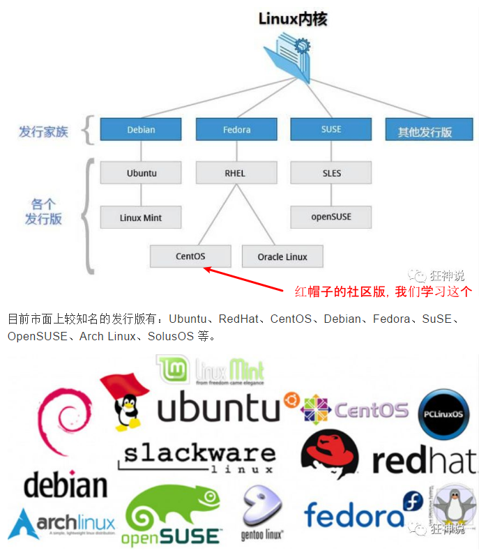

# 0. Intro to Linux

## Linux是什么

- 芬兰人林纳斯·托瓦兹（Linus Torvalds）在赫尔辛基大学时出于**个人爱好**编写的
- Linux是一套**免费**和**自由传播**的**类Unix操作系统**， “是一个基于 POSIX（可移植操作系统接口） 和 UNIX 的多用户、多任务、支持多线程和多 CPU 的操作系统。”
- 以网络为核心
- 性能稳定，多用户

## Linux发行版本

Linux 的发行版说简单点就是将 Linux 内核与应用软件做一个打包。

Kali - 黑客专用，**测试安全漏洞**

## Linux可以干什么

- 对我们自己来来说，作为一个“码农”，我们会在以下领域用到Linux作为环境

  部署服务器，集群分布式，消息队列（Kafka、RabbitMQ、RocketMQ），缓存（Redis），搜索引擎（ES）

- 嵌入式设备（Raspberry PI）

- 超级计算机

- **服务器大量使用Linux，这也是我们以后最常见的应用场景**

==为什么这些事情一定要在Linux上做？== 

## Linux的优缺点

其实Linux和windows就是在因为目标不同，在工程上做了不同的取舍，Windows面向普通用户且收费，漂亮、支持多、普及度广，可是收费、把内部层层包裹；Linux面向开发者，至少不是普通人，免费、丑、支持少、普及度低、但是免费呀，而且内部都暴露在大家面前呀，好深入学习。

## 为什么要学习Linux

- 作为程序员，Linux是必须掌握的，**因为大家都会，而且都在用**
- 想部署自己的**服务器**，就要学习Linux
- Devop从业者必须深入使用了解Linux
- 学习新知识总是好的！

## 怎么学习Linux

1. 了解Linux的历史，来源，优点，为什么要学习Linux

2. 安装、配置Linux

3. 学习基本操作

4. 学习在Linux上

   部署服务器，集群分布式，消息队列（Kafka、RabbitMQ、RocketMQ），缓存（Redis），搜索引擎（ES）

