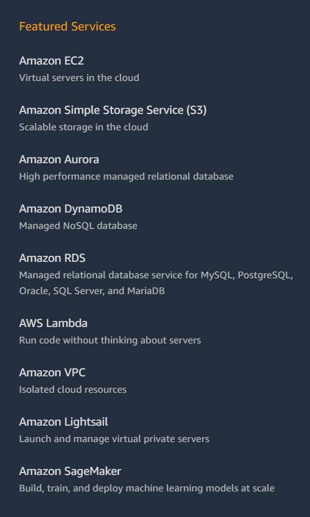

# Intro to Cloud Server

## 什么是Cloud Server

顾名思义，cloud server 对应local server，local server是你家里的一台电脑，cloud server是别人家的一台电脑，借用（收钱）给你，运行在远程，通过网络可以控制。

## Cloud Compute Service

在2020年，没人去租一台“机器”了，而是去租一个“服务”。也就是说为你服务的不局限与一台机器，可以是大量机器组成的分布式云计算网络，这样可以按照你的需求灵活分配计算力，储存空间，而且；用户无需拥有硬件，只需使用浏览器，桌面程序即可快速部署、操纵应用，而且大大降低了管理复杂度和维护成本。主流的CCS提供商：AWS，Orcale cloud，google cloud，阿里云，华为云。

## AWS -  云服务的巨头

Elastic Compute Cloud， 弹性云计算EC2，就是亚马逊的云上虚拟服务器。

下图是AWS的主流服务，可以看到EC2排在第一位

S3是云储存

Aurora是亚马逊开发的大型分布式关系型数据库

Lambda与微服务有关

# 阿里云

当然是噜噜噜噜噜噜羊毛啦啦啦，aws有免费试用，但是坑太多，一不小心就交钱了。所以我们转而撸阿里云针对外国用户的羊毛。

## 使用宝塔服务器运维面板

什么是bt服务器运维面板？ - 一键安装软件、环境，一键管理服务器端口，可视化的服务器管理界面。

为什么要使用宝塔面板？- 简单

安装宝塔面板

## xshell and xftp

什么是xshell？ - netsarang公司出品的终端模拟器，支持ssh1，ssh2，以及TELNET协议。用来模拟远程主机的终端。

什么是xftp？ - 用来在本地机器和远程主机之间传输文件

怎么下载？ - netsarang提供了免费版供学生和家庭使用，下载链接如下，注册后会在邮箱中两封分别含有xshell和xftp下载链接的邮件，所以不要瞎填邮箱，下载，安装即可

[免费版下载链接](https://www.netsarang.com/en/free-for-home-school/)

## 题外话

我们看到xshell支持ssh，而且之前在github也见过通过ssh clone项目，那么什么是ssh呢？

SSH - Secure Shell - 又名安全外壳协议，是一种加密的网络传输协议，可以提供安全的网络传输环境。SSH的经典应用是登陆到远程电脑中执行命令

简单说一下ssh的非对称加密和身份验证。

> SSH以[非对称加密](https://zh.wikipedia.org/wiki/非对称加密)实现[身份验证](https://zh.wikipedia.org/wiki/身份验证)[[2\]](https://zh.wikipedia.org/wiki/Secure_Shell#cite_note-rfc4252-2)。身份验证有多种途径，例如其中一种方法是使用自动生成的公钥-私钥对来简单地加密网络连接，随后使用密码认证进行登录；另一种方法是人工生成一对公钥和私钥，通过生成的密钥进行认证，这样就可以在不输入密码的情况下登录。任何人都可以自行生成密钥。公钥需要放在待访问的电脑之中，而对应的私钥需要由用户自行保管。认证过程基于生成出来的私钥，但整个认证过程中私钥本身不会传输到网络中。
>
> SSH协议有两个主要版本，分别是SSH-1和SSH-2。无论是哪个版本，核实未知密钥来源都是重要的事情，因为SSH只验证提供用户是否拥有与公钥相匹配的私钥，只要接受公钥而且密钥匹配服务器就会授予许可。这样的话，一旦接受了恶意攻击者的公钥，那么系统也会把攻击者视为合法用户。

简单来说就是，公钥存在被访问的电脑中，用户持有私钥，登陆过程不会涉及到密码在网络中的传输，从而实现安全

## 配置安全组及连接

1. 设置安全组面板，开启端口

   

2. 重置服务器密码

   

3. 获取公网ip

   

4. 在xshell上登陆

   首先配置new session

   

   然后设置用户名为root，密码为aliyun密码

   

   

   出现“welcome to alibaba cloud 。。。。” 证明登上了

   输入exit即可退出连接，或者点击工具栏中disconnect图标

5. 在xftp上上传一个文件

   首先配置，与xshell类似

   

拖拽可以直接上传文件

点击disconnect图标即可断开连接