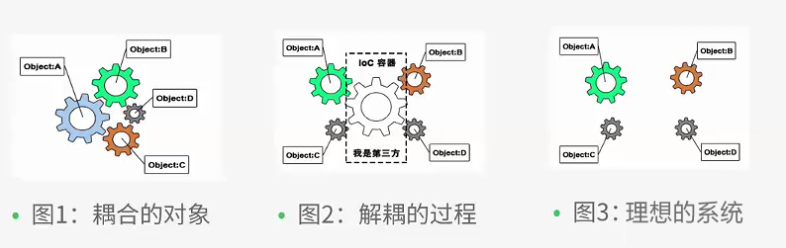
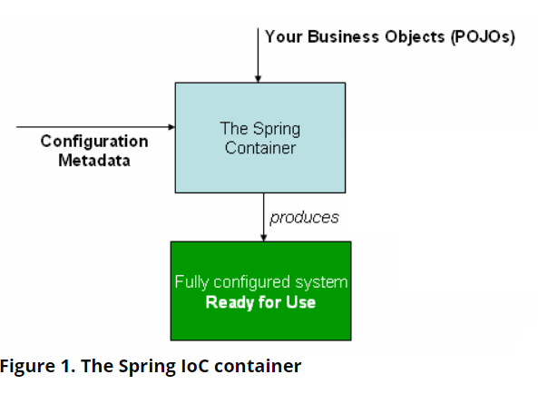
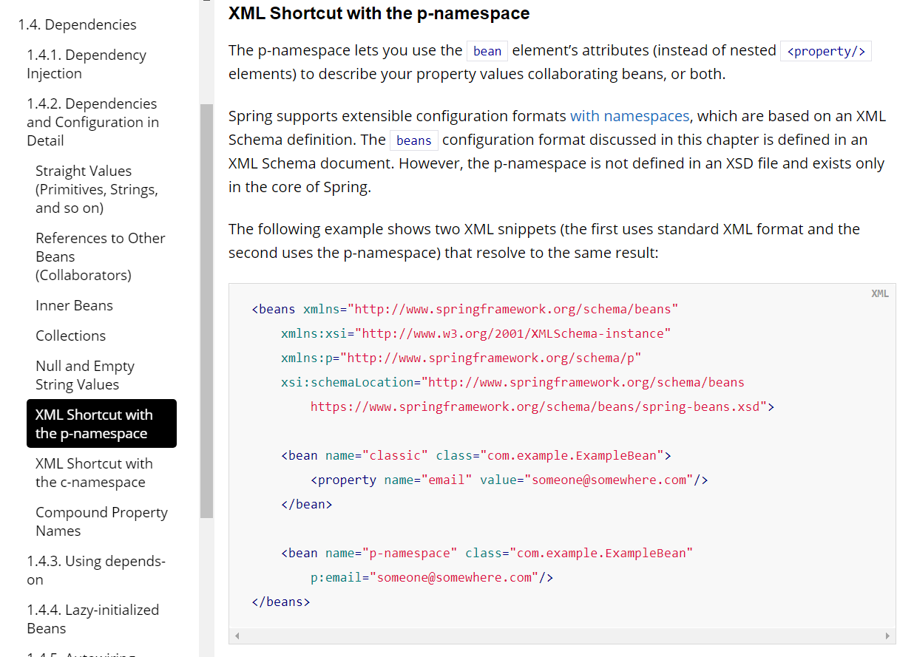
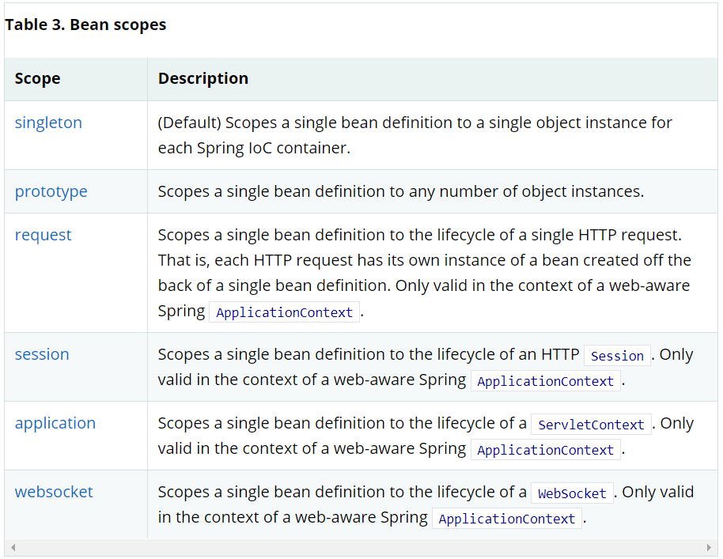
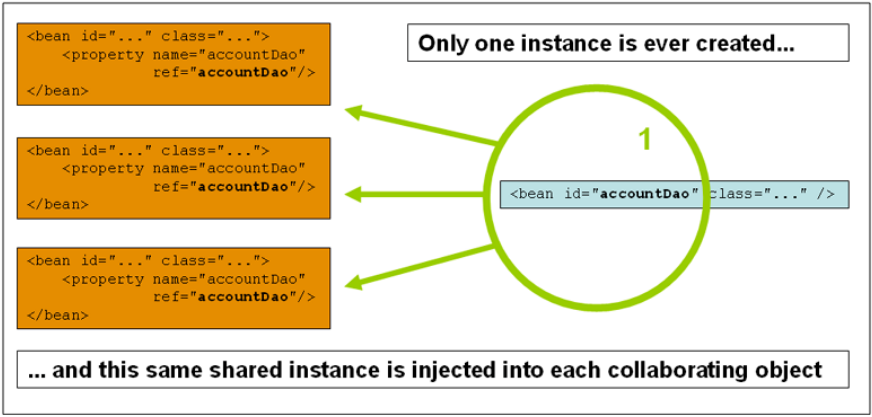
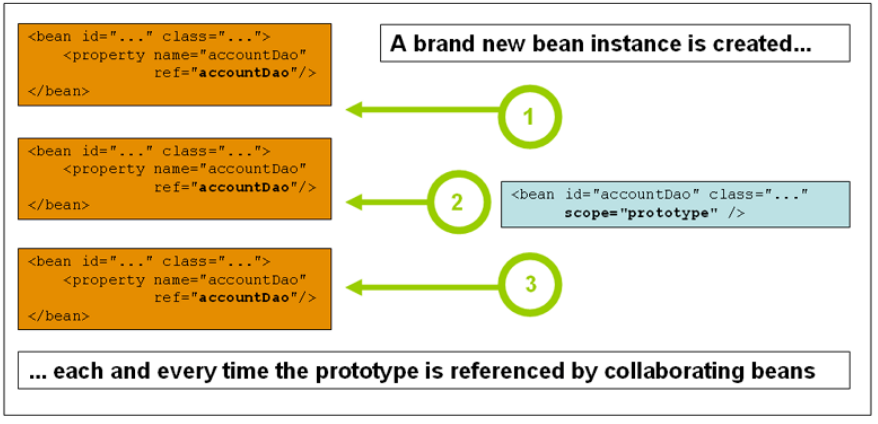
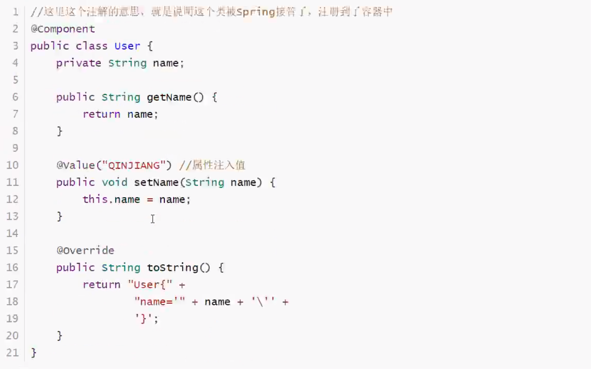
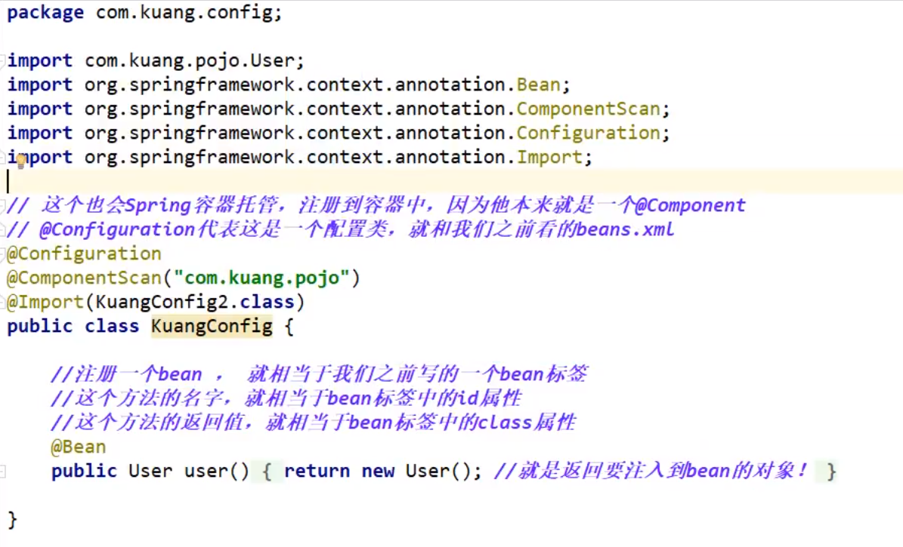
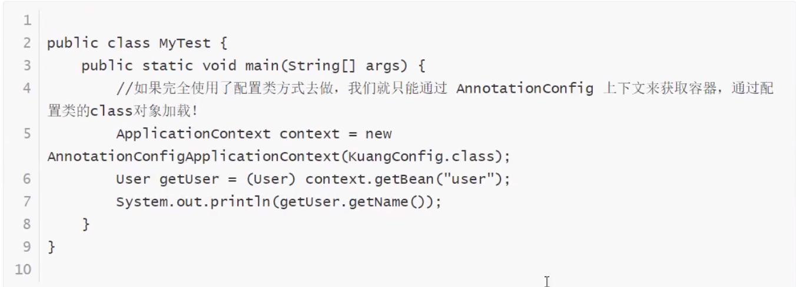

# 1. SPRING

## 1.1 What is Spring?

- Java EE framework: make java ee development easier

- Rod Johoson - founder, 音乐博士

- >  Don't Reinventing the wheel

- 理念：整合现有框架，解决企业级开发难的问题

- SSH: Struct2 + Spring + Hibernate - 老一套

- SSM: SrpingMvc + Spring + Mybatis (与上面三项相互对应) - 新一套

### 下载

Maven

spring-mvc即可

```xml
<dependency>
    <groupId>org.springframework</groupId>
    <artifactId>spring-webmvc</artifactId>
    <version>5.2.0.RELEASE</version>
</dependency>
```

官网

## 1.2 优点
- open source free framework （container）
- Spring 是轻量级的、非入侵式的框架
- **控制反转（IOC），面向切面编程（AOP）**
- 支持事务处理（因为AOP），对框架整合的支持（几乎市面上所有java框架都可以整合进去）

**总结：Spring就是一个轻量级的控制反转（IOC）和面向切面编程（AOP）的框架**

### 1.3 七大模块


### 1.4 拓展

在Spring的官网上有这样的介绍：现代化的java开发！说变了就是基于Spring的开发！
构建一切（Spring Boot)，协调一切(spring cloud)，连接一切(spring cloud data flow)

- Spring Boot
  - 一个快速开发的脚手架
  - 基于Spring Boot可以快速开发单个微服务
  - 约定大于配置！(和maven类似)
- Spring Cloud
  - Spring Cloud 是基于Spring Boot实现的

WHY？大多数公司都在用Spring Boot进行快速开发，学习Spring Boot的前提，需要**完全掌握Spring以及Spring MVC**！承上启下的作用！

有什么弊端吗？发展了太久之后，违背了原来的理念！配置十分繁琐，人称：“配置地狱”

# 2. IOC理论推导
1. UserDao 接口
2. UserDaoImpl 实现类
3. UserService 业务接口 - 用户调用service， service调用dao
4. UserServiceImpl 业务实现类

在我们之前的业务中，永辉的需求可能会影响我们原来的代码，我们需要根据永辉的需求去修改源代码。如果project很大，所以修改一次的成本昂贵

For example，我们利用set接口实现。

- 之前，程序是主动创建对象！控制权在程序员手里
- 使用了set注入后，程序不在具有主动性，成为被动接受用户自定义的对象

这种思想，从本质上解决了问题，系统性的耦合性大大降低，可以更加关注于横向拓展业务，而不用关注在修改服务代码了。

##  IOC 本质

控制反转IoC（Inversion of Control）， 是一种设计思想， DI(依赖注入)是实现IoC的一种方法。没有IoC的程序中，我们使用面向对象编程，对象的创建与对象间的依赖关系完全hard code在程序中，对象的创建由程序自己控制， 控制反转后对象的创建交给第三方，个人认为所谓控制反转就是：**获得依赖对象的方式反转了**



采用XML方式配置Bean的时候， Bean的定义信息是与实现分离的，而采用注解的方式可以把两者合为一体，Bean的定义信息直接以注解的形式定义在实现类中， 从而达到了零配置的目的。

控制返回钻石一种通过藐视（xml注解）并通过第三方去生成或获取特定对象的方式。在Spring中实现控制反转的是IoC容器，其实现方法是**依赖注入（Dependency Injection, DI)

# 3. Spring IoC container 

## 3.1 Spring IoC container运行原理



## 3.2 HelloSpring 实例演示

首先创建Hello class

```java
public class Hello {
     private String name;
 
     public String getName() {
         return name;
     }
     public void setName(String name) {
         this.name = name;
     }
 
     public void show(){
         System.out.println("Hello"+ name );
     }
 }
```

在beans.xml中进行配置

```xml
<?xml version="1.0" encoding="UTF-8"?>
   <beans xmlns="http://www.springframework.org/schema/beans"
          xmlns:xsi="http://www.w3.org/2001/XMLSchema-instance"
          xsi:schemaLocation="http://www.springframework.org/schema/beans
           http://www.springframework.org/schema/beans/spring-beans.xsd">
   
       <!--bean就是java对象 , 由Spring创建和管理
		java 原始写法：
		类型 变量名 = new 类型（）；
		Hello hello = new Hello();
		在Spring中，对象都有spring创建，并且叫做“bean”
		在bean的定义中：
		id = 变量名
		class = 类型的全路径
		property 相当于给对象中的属性"name"赋值为“Spring”
		-->
       <bean id="hello" class="com.kuang.pojo.Hello">
           <property name="name" value="Spring"/>
      </bean>
  
  </beans>
```

test

```java
@Test
 public void test(){
     //解析beans.xml文件 , 生成管理相应的Bean对象
     ApplicationContext context = newClassPathXmlApplicationContext("beans.xml");
     //getBean : 参数即为spring配置文件中bean的id .
     Hello hello = (Hello) context.getBean("hello");
     hello.show();
 }
// output: Hello{str='Spring'}
```

- Hello是谁创建的
  - 是Spring容器创建的
  - 程序只是从这个容器中拿取，使用
- Hello的属性“name”是谁设置的
  - 是Spring容器设置的

搞清楚这个案例，我们就基本可以理解什么叫做**Ioc控制反转**了：

- 控制：谁来控制对象的创建？传统应用程序的对象是由程序本身去创建的，而在spring中，对象是由Spring来创建的
- 反转：程序本身不创建对象，变成别动接受对象（从ApplicationContext中得到bean，也就是对象）
- 依赖注入（DI - Dependency Injection）：我们写好的被spring管理的类必须有set接口，spring也就是依赖set方法进行注入的

IOC是一种变成思想，由程序主动创建对象变为被动接受（抓取）Spring中管理的对象。当我们把产品交给用户的时候，用户可以通过修改.xml配置文件（或通过修改配置文件的接口）来获得新的服务，而无需修改代码。用一句话总结就是: 对象由Spring来创建，管理，装配！ 用上面客人在饭店吃水果的案例来做类比的话，就是传统非Spring Java项目就像老式餐厅，面对不同客人的需求必须临时对餐厅内部工作流程做出更改，比如原先买苹果的采购员现在需要去买橘子了；而Spring Java project就像快餐厅，都是做好的菜谱，除了新的菜谱，不需要对整个餐厅做出重大改动，只需在保温格中给新菜品分配一个位置即可。

# 4. IoC 创建对象的方式

思考一个问题：IoC容器是如何（何时）创建对象的？

DI利用了factory设计模式。

IoC创建对象的几种方法：

1. 默认方法：利用类的无参构造new出对象, 之后再对property进行set

   ```xml
   <bean id="user" class="com.vodka.pojo.User">
   	<property name="name" value="wdnmd"/>
   </bean>
   ```

   利用无参构造new object，必须通过property tag才能修改值

2. 使用有参构造，一旦出现构造函数，就无法使用无参构造进行初始化

   1. 引用object（bean）作为参数，按照顺序

      ```xml
      <beans>
          <bean id="beanOne" class="x.y.ThingOne">
              <constructor-arg ref="beanTwo"/>
              <constructor-arg ref="beanThree"/>
          </bean>
      
          <bean id="beanTwo" class="x.y.ThingTwo"/>
      
          <bean id="beanThree" class="x.y.ThingThree"/>
      </beans>
      ```

   2. index赋值 -  The index is 0-based

      ```xml
      <bean id="exampleBean" class="examples.ExampleBean">
          <constructor-arg index="0" value="7500000"/>
          <constructor-arg index="1" value="42"/>
      </bean>
      ```

   3. 类型匹配 - **多个构造器，每个property只有一个时使用**

      ```xml
      <bean id="exampleBean" class="examples.ExampleBean">
          <constructor-arg type="int" value="7500000"/>
          <constructor-arg type="java.lang.String" value="42"/>
      </bean>
      ```

      

   4. 参数名 - **重点掌握**

      ```xml
      <bean id="exampleBean" class="examples.ExampleBean">
          <constructor-arg name="years" value="7500000"/>
          <constructor-arg name="ultimateAnswer" value="42"/>
      </bean>
      ```

   5. **以上三种和可以混用**

总结，在配置文件加载的时候（在这句话执行的时候）

```java
ApplicationContext context = new ClassPathXmlApplicationContext("beans.xml");
```

容器中管理的对象就已经初始化了。

> Question：IoC容器是如何管理object的？在哪里存放已经生产的object？

# 5. Spring配置

## 5.1 alias - 别名

```xml
<alias name="fromName" alias="toName"/>
```

添加了别名，也可以通过别名access到这个bean

## 5.2 bean 的attributes 配置

1. id - bean的唯一标识符，也就是相当于对象名
2. class - bean对象对应的全限定名， 
3. name - 也就是别名，可以取多个别名，使用逗号、空格、分号分割

```xml
    <bean id="user" class="com.vodka.pojo.User" name="user3, u4, u5 u6; u7">
        <constructor-arg name="age" value="-8"/>
        <constructor-arg name="name" value="fufu"/>
    </bean>
```

## 5.3 import

一般用于团队开发使用，可以将多个配置文件，导入合并为一个

> applicationContext.xml 才是正宗的spring配置文件总入口名字

项目中由多个人开发多个类，不同的类注册在不同的bean中，并写在自己的配置文件下，最后将所有配置文件import如applicationContext.xml 中，并在程序中使用此文件。


# 6. Dependence Injection

## 6.1 Constructor DI

请参考 **4. IoC创建对象的方式**

## 6.2 Setter-based DI - 重点

- 依赖注入： setter注入
  - 依赖：bean对象的创建依赖于容器
  - 注入：bean对象中的所有属性，由container来注入

### 6.2.1 环境搭建

> Idea shortcut: alt+insert: create setter/getter, toString....
>
> K4 Keyboard insert: fn+del

1. 足够复杂的真实类（Student）

   ```java
   package com.vodka.pojo;
   
   import java.util.*;
   
   public class Student {
       private String name;
       private Address address;
       private String[] books;
       private List<String> hobbys;
       private Map<String, String> card;
       private Set<String> games;
       private Properties info;
       private String wife;
   
       public Student() {
       }
   
       public String getName() {
           return name;
       }
   
       public void setName(String name) {
           this.name = name;
       }
   
       public Address getAddress() {
           return address;
       }
   
       public void setAddress(Address address) {
           this.address = address;
       }
   
       public String[] getBooks() {
           return books;
       }
   
       public void setBooks(String[] books) {
           this.books = books;
       }
   
       public List<String> getHobbys() {
           return hobbys;
       }
   
       public void setHobbys(List<String> hobbys) {
           this.hobbys = hobbys;
       }
   
       public Map<String, String> getCard() {
           return card;
       }
   
       public void setCard(Map<String, String> card) {
           this.card = card;
       }
   
       public Set<String> getGames() {
           return games;
       }
   
       public void setGames(Set<String> games) {
           this.games = games;
       }
   
       public Properties getInfo() {
           return info;
       }
   
       public void setInfo(Properties info) {
           this.info = info;
       }
   
       public String getWife() {
           return wife;
       }
   
       public void setWife(String wife) {
           this.wife = wife;
       }
   
       @Override
       public String toString() {
           return "Student{" +
                   "name='" + name + '\'' +
                   ", address=" + address +
                   ", books=" + Arrays.toString(books) +
                   ", hobbys=" + hobbys +
                   ", card=" + card +
                   ", games=" + games +
                   ", info=" + info +
                   ", wife='" + wife + '\'' +
                   '}';
       }
   }
   
   ```

   ```java
   package com.vodka.pojo;
   
   public class Address {
       private String address;
   
       public void setAddress(String address) {
           this.address = address;
       }
   
       public String getAddress() {
           return address;
       }
   }
   
   ```

2. applicationContext.xml 

   ```xml
   <?xml version="1.0" encoding="UTF-8"?>
   <beans xmlns="http://www.springframework.org/schema/beans"
          xmlns:xsi="http://www.w3.org/2001/XMLSchema-instance"
          xsi:schemaLocation="http://www.springframework.org/schema/beans
           https://www.springframework.org/schema/beans/spring-beans.xsd">
   
       <!--by name-->
       <bean id="student" class="com.vodka.pojo.Student">
           <property name="name" value="vodka"/>
       </bean>
   
       <alias name="user" alias="user2"/>
   </beans>
   ```

3. 测试类

   ```java
   import com.vodka.pojo.Student;
   import org.springframework.context.ApplicationContext;
   import org.springframework.context.support.ClassPathXmlApplicationContext;
   
   public class MyTest {
       public static void main(String[] args) {
           ApplicationContext context = new ClassPathXmlApplicationContext("applicationContext.xml");
           Student vodka = (Student) context.getBean("student");
           System.out.println(vodka);
       }
   }
   
   ```

### 6.2.2 不同类型数据的注入

```java
    <bean id="address" class="com.vodka.pojo.Address">
        <property name="address" value="Portland"/>
    </bean>

    <bean id="student" class="com.vodka.pojo.Student">
        <!--1. value DI-->
        <property name="name" value="vodka"/>

        <!--2. Bean DI-->
        <property name="address" ref="address"/>

        <!--3. array DI-->
        <property name="books">
            <array>
                <value>红楼梦</value>
                <value>水浒传</value>
                <value>三国演义</value>
                <value>西游记</value>
            </array>
        </property>

        <!--4. list DI-->
        <property name="hobbys">
            <list>
                <value>听歌</value>
                <value>coding</value>
                <value>看电影</value>
            </list>
        </property>
        
        <!--5. map DI-->
        <property name="card">
            <map>
                <entry key="class" value="2019"></entry>
                <entry key="stuId" value="1234567"/>
            </map>
        </property>
        
        <!--6. set-->
        <property name="games">
            <set>
                <value>LOL</value>
                <value>LOL</value>
                <value>DOD</value>
                <value>COC</value>
            </set>
        </property>
        
        <!--7. null-->
        <property name="wife">
            <!--<null></null>-->
            <value></value>
        </property>

        <!--8. properties-->
        <property name="info">
            <props>
                <prop key="driver">20200623</prop>
                <prop key="url">dfjidgj.com</prop>
                <prop key="username">kzhang</prop>
                <prop key="password">666666</prop>
            </props>
        </property>
    </bean>

```


##　6.3 拓展方式注入

1. p命名空间 - p-namespace 
2. c命名空间 - c-namespace

## 6.3.1  原理



## 6.3.2 使用

```xml
<?xml version="1.0" encoding="UTF-8"?>
<beans xmlns="http://www.springframework.org/schema/beans"
       xmlns:xsi="http://www.w3.org/2001/XMLSchema-instance"
       xmlns:p="http://www.springframework.org/schema/p"
       xmlns:c="http://www.springframework.org/schema/c"

       xsi:schemaLocation="http://www.springframework.org/schema/beans

        https://www.springframework.org/schema/beans/spring-beans.xsd">
    <!--p-namespace, 可以直接注入属性的值：property-->
    <bean id="user" class="com.vodka.pojo.User" p:name="Gin" p:age="181">
    </bean>

    <!--c-namespace, 通过构造器注入：constructor-->
    <bean id="user2" class="com.vodka.pojo.User" c:age="100" c:name="xiaohong"/>
</beans>
```

### 6.3.3 特别注意

c-namespace和p-namespace分别对应DI by constructor 和DI by setter，要使用这种写法必须在applicationContext文件头加入注释

```xml
xmlns:p="http://www.springframework.org/schema/p"
xmlns:c="http://www.springframework.org/schema/c"
```

# 7. Bean Scope - 作用域



## 7.1 Singleton

单例模式 - 一个bean只创建一个对象，是spring的默认模式

好处：节省资源

坏处：多线程下有问题



```java
<bean id="accountService" class="com.something.DefaultAccountService"/>

<!-- the following is equivalent, though redundant (singleton scope is the default) -->
<bean id="accountService" class="com.something.DefaultAccountService" scope="singleton"/>
```

## 7.2 Prototype

原型模式: 每次从容器中get的时候，都会产生一个新对象

好处：多线程没问题

坏处：浪费资源



```java
<bean id="accountService" class="com.something.DefaultAccountService" scope="prototype"/>
```

## 7.3 其余的request, session, application 只与spring web开发有关

# 8. Bean 的自动装配 - Auto-wired

- 自动装配是Spring满足bean依赖的一种方式！
- Spring会在上下文中自动寻找， 并自动给bean装配属性

在Spring中有三种装配方式

1. 在xml中显示的装配
2. 在java中显示装配
3. 隐式的自动装配bean （重要！）

## 8.1 测试

环境搭建： 一个people类，加两个宠物类

## 8.2 ByName自动装配

```xml
<bean id="cat" class="com.vodka.pojo.Cat"></bean>

<bean id="dog" class="com.vodka.pojo.Dog"></bean>
<!--
    byName: 自动在容器上下文找，与此bean所管理的对象中property名字相同的beanid
    注意：setter方法的name，被寻找bean的id，还有此bean所管理对象的property 名字必须相同！
-->
<bean id="people" class="com.vodka.pojo.People" autowire="byName">
    <!--<property name="cat" ref="cat"/>
    <property name="dog222" ref="dog222"/>这里是不用autowire的写法-->
    <property name="name" value="vodka"/>
</bean>
```

注意：id为dog222的bean必须与people class中property dog222名字完全一致，**而且setter方法的名字也必须一致为setDog222**

## 8.3 ByType 自动装配

```xml
<bean class="com.vodka.pojo.Cat"></bean>

<bean id="dog" class="com.vodka.pojo.Dog"></bean>	
<!--
    byType: 自动在容器上下文找，与此bean所管理的对象中property类型相同的beanid
    -->
<bean id="people" class="com.vodka.pojo.People" autowire="byType">
    <!--<property name="cat" ref="cat"/>
        <property name="dog222" ref="dog222"/>-->
    <property name="name" value="vodka"/>
</bean>
```

注意：此处id为dog的bean不一定要与property name dog222一致，但是类型必须一致；这种方法当出现多个同类型property时就不好使了。**甚至可以不给dog bean id**

## 8.4 小结

- byName：beanid必须与property name，setter 方法一致
- byType：property class必须和bean class一致，同时必须唯一！

# 9. 使用注解 开发

## 9.1 Which one is better

> The introduction of annotation-based configuration raised the question of whether this approach is “better” than XML. The short answer is “it depends.”

## 9.2  使用注解的前提条件

使用注解须知

1. 导入约束：context约束
2. 配置注解的支持 ` <context:annotation-config/>` 

```xml
<?xml version="1.0" encoding="UTF-8"?>
<beans xmlns="http://www.springframework.org/schema/beans"
    xmlns:xsi="http://www.w3.org/2001/XMLSchema-instance"
    xmlns:context="http://www.springframework.org/schema/context"
    xsi:schemaLocation="http://www.springframework.org/schema/beans
        https://www.springframework.org/schema/beans/spring-beans.xsd
        http://www.springframework.org/schema/context
        https://www.springframework.org/schema/context/spring-context.xsd">

    <context:annotation-config/>

</beans>
```

## 9.3 Autowired and Resource

### @Required

此property必须在创建bean时同时赋值以避免NPE，这个已经在spring5.1退休了，以constructor DI方法代替

### 9.3.1 @Autowired

- 属性优先，then name
- 直接在属性上使用，或在setter方法上使用
- 使用Autowired，可以不用编写Setter放了，前提是这个自动装配的属性在IoC（Spring）容器中存在，且符合ByType条件

### 9.3.2 @Autowired  + @Qualifier("beanid")

若通过type找到多个bean，需要使用Qualifier标签，explicitly标注哪一个bean

### 9.3.3  @Resource(name="myMovieFinder")

如果没有明确说name，那么会使用setter 或者 property的name作为default name

### 9.4.4 小结

@Resource和@Autowired的区别

- 都是用来自动装配的，都可以放在属性字段上

- @Autowired  默认ByType优先，then ByName

- @Resource 默认通过byname实现，如果找不到名字，再用byType实现。在两个都找不到的情况下，就报错

## 9.4 @Component

标注在class上，意思是创造一个bean给这个class，默认beanid = class name小写

配合 @Value("value") 可以set value，写在property上面

在mvc三层架构中，Component有别名

1. 在dao层中 - @Repository
2. 在service层中 - @Service
3. 在controller层中 - @Controller

这几个注解功能是一致的，都是将class放到容器中

## 9.5 Scope 作用域注解

@Scope（“singleton") 加在class上

## 9.6 小结

> `<context:component-scan base-package="org.example"/>` 可以指定在某一文件夹下开启注解

xml与注解

- xml更加万能， 适用于任何场合，维护方便
- 注解：不是自己的类看不了，维护相对复杂

最佳实践

- xml负责管理bean
- anno负责注入属性
- 特别注意一个问题，开启注解支持

# 10. JavaConfig

完全不需要xml，通过直接在java code中加入annotation来配置bean和DI

1. @Configuration

   代表这是一个配置类，就像我们之前看的beans.xml

2. @Bean

   1. 在Configuration类中，这意味着创建一个bean
   2. 方法名就是bean名

3. @Import(KuangConfig2.class) - 引入另一个config 类

例子

实体类 pojo



配置类



测试




