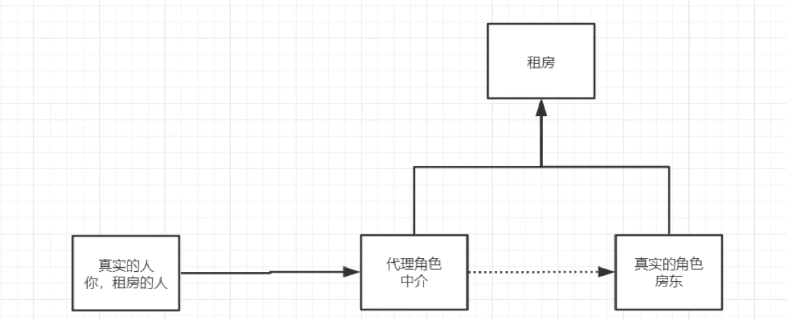
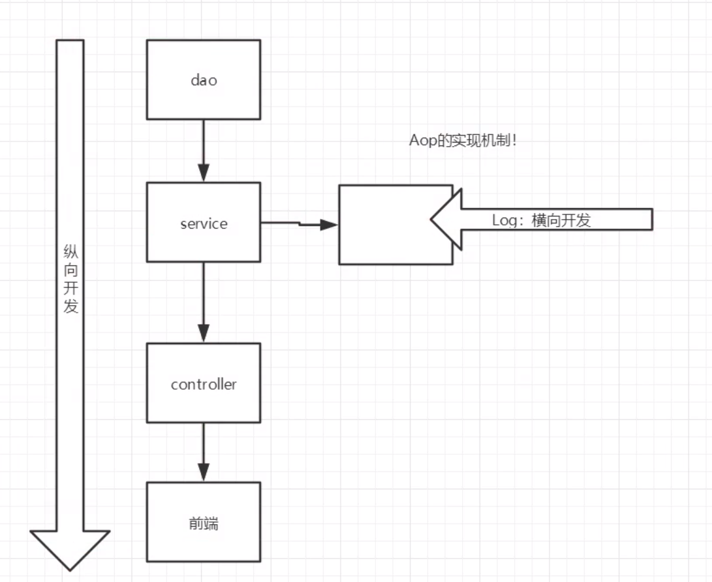

Spring 下 - AOP

# 10. 代理模式 - Proxy pattern

为什么要学习代理模式？ - 因为代理模式就是SpringAOP的底层！（SpringAOP和SpringMVC）

什么是代理模式？



## 代理模式由两种

- 静态代理
- 动态代理

## 10.1 静态代理

角色分析：

- 抽象角色：一般使用接口或者抽象类
- 真实角色：被代理的角色
- 代理角色：代理真实角色，代理真实角色后，一般会所一些附属操作
- 客服：访问代理对象的人

步骤：

1. 接口

   ```java
   package com.vodka.demo01;
   
   public interface Rent {
       void rent();
   }
   ```

2. 真实角色

   ```java
   package com.vodka.demo01;
   
   public class Host implements Rent{
       public void rent() {
           System.out.println("Here is your house!");
       }
   }
   ```

3. 代理角色

   ```java
   package com.vodka.demo01;
   
   public class Proxy {
       private Host host;
   
       public Proxy() {}
   
       public Proxy(Host host) {
           this.host = host;
       }
   
       public void rent() {
           showHouse();
           host.rent();
           hetong();
           fare();
       }
   
       // hetong
       public void hetong() {
           System.out.println("签合同");
       }
       // fare
       public void fare(){
           System.out.println("收中介费");
       }
       // house tour
       public void showHouse() {
           System.out.println("看房");
       }
   }
   ```

4. 客户端访问代理角色

   ```java
   package com.vodka.demo01;
   
   public class Client {
       public static void main(String[] args) {
           // 直接找房东
           Host host = new Host();
           host.rent();
   
           // Proxy
           // 代理，一定有一些附属操作，不然没有意义
           Proxy proxy = new Proxy(host);
           proxy.rent();
       }
   }
   ```

今天代理模式的好处：

1. 可以使真实角色的业务更加纯粹，无需关注公共业务
2. 公共业务交给代理，实现了业务的分工
3. 公共业务发生扩展时，方便集中管理

缺点：

1. 一个真实角色就会产生一个代理角色；代码量翻倍，开发效率降低

**注意：可从来没人说过是为了减少代码量**

## 深入理解静态代理

Demo: spring-08-proxy

到底为什么要用proxy模式？ - **在不修改原有代码的情况下实现新功能**

那么和AOP有什么关系呢？ - **在原有的纵向开发流程中做切入**



## 10.2 动态代理

- 动态代理角色与静态代理一样
- 动态代理的代理类是动态生成的，并非手写
- 动态代理分为两大类：基于接口、基于类的动态代理
  - 基于接口 -- JDK动态代理
  - 基于类 - cglib
  - java字节码： JAVAssist

这里我们使用基于接口的JDK动态代理

需要了解两个类：Proxy：代理，InvocationHandler(Interface)：调用处理程序

> Proxy: provides static methods for creating dynamic proxy classes and instances, and it is also the superclass of all dynamic proxy classes created by those methods.

Proxy是一个工具类，

> InvocationHandler: Each proxy instance has an associated invocation handler. When a method is invoked on a proxy instance, the method invocation is encoded and dispatched to the `invoke` method of its invocation handler

动态代理需要通过一个实现了InvocationHandler的“Handler”来对这个代理进行管理，这样我们就不用像静态代理一样，在agent类中二次写真实角色的业务

**Incocationhandler 万能实现** 

参考代码：spring-08-proxy-demo04

```java
package com.vodka.demo04;

import java.lang.reflect.InvocationHandler;
import java.lang.reflect.Method;
import java.lang.reflect.Proxy;

public class ProxyHandler implements InvocationHandler {
    // 只要是实现了
    // 被代理的接口
    private Object service;

    public ProxyHandler(Object target) {
        this.service = target;
    }

    // 返回一个dynamic proxy Instance
    public Object getProxy() {
        return Proxy.newProxyInstance(this.getClass().getClassLoader(),
                service.getClass().getInterfaces(),
                this);
    }

    // 处理代理的实例并且返回结果
    public Object invoke(Object proxy, Method method, Object[] args) throws Throwable {
        log(method.getName());

        Object result = method.invoke(service, args);

        return result;
    }

    // 增加一个log业务，记录每一次操作
    private void log(String msg){
        System.out.println("执行了" + msg + "方法");
    }
}

```

**测试类**

```java
package com.vodka.demo04;
import java.lang.reflect.Proxy;

public class Client {
    public static void main(String[] args) {
        // 创建真实用户
        UserService userService = new UserServiceImpl();
        RentService rentService = new Host();

        // 获得动态代理handler
        ProxyHandler proxyHandler = new ProxyHandler(userService);
        ProxyHandler rentProxyHandler = new ProxyHandler(rentService);

        // 获得代理
        // Proxy proxy = (Proxy) proxyHandler.getProxy(); 这是错误的
        UserService proxy = (UserService) proxyHandler.getProxy();
        RentService rentProxy = (RentService) rentProxyHandler.getProxy();

        // 使用代理
        proxy.query();
        proxy.delete();

        // 使用rent代理
        rentProxy.rent();
    }
}
```


## 动态代理的好处

- 首先，他拥有静态代理的所有好处
  - 可以使真实角色专注于业务，不必关注公共业务
  - 实现了业务的分工
  - 在增加新业务时，无需改动真实角色的code
  - 公共业务发生扩展的时候，方便集中管理
- 一个动态代理类代理的是一个接口，一般就是对应的一类业务
- 一个动态代理类可以代理一类业务，只要实现的是同一个接口


# 11. AOP

## 11.1 什么是AOP

## 11.2

## 11.3 使用Spring实现AOP

首先要引入一个Dependency

```xml
<dependency>
    <groupId>org.aspectj</groupId>
    <artifactId>aspectjweaver</artifactId>
    <version>1.9.4</version>
</dependency>
```

方法一：使用Spring的API接口


