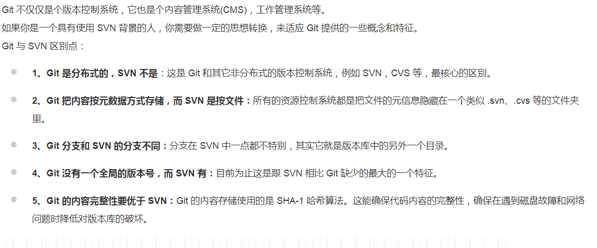
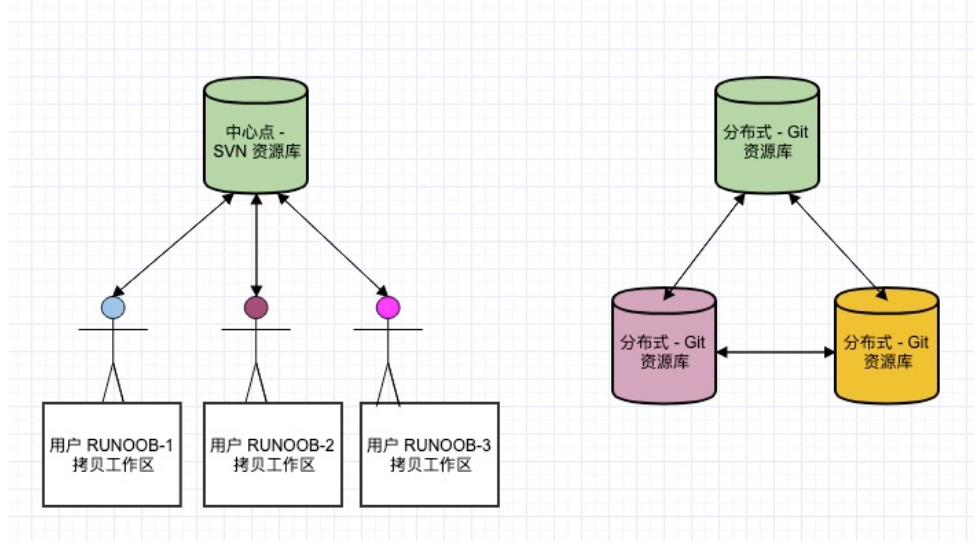
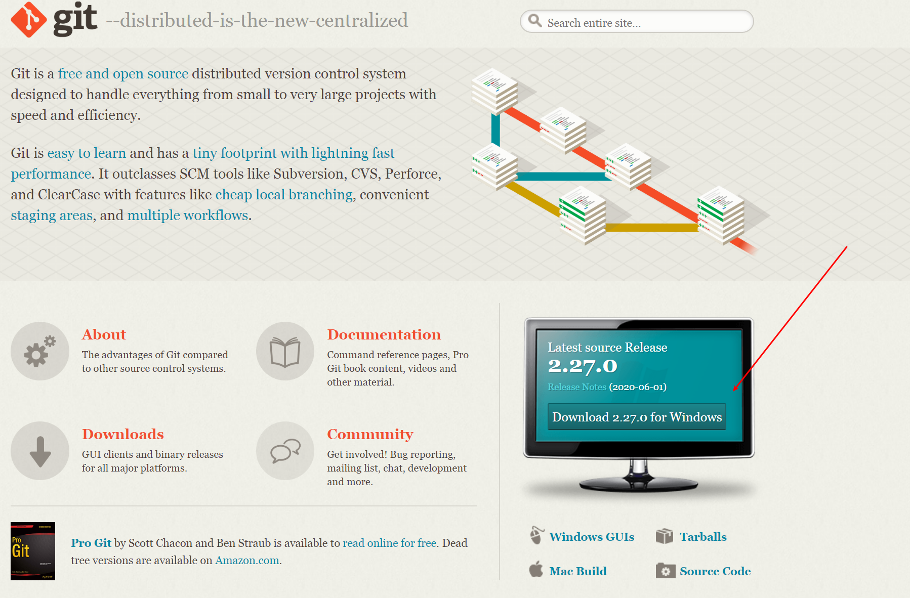
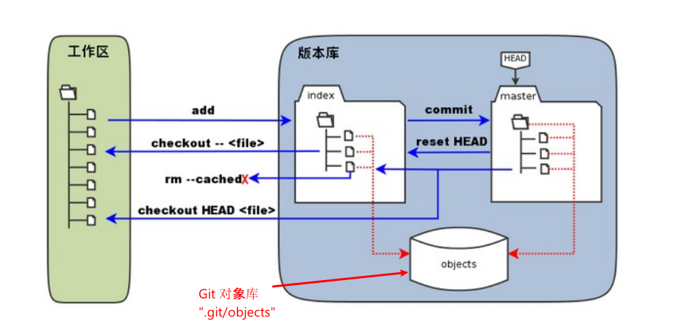
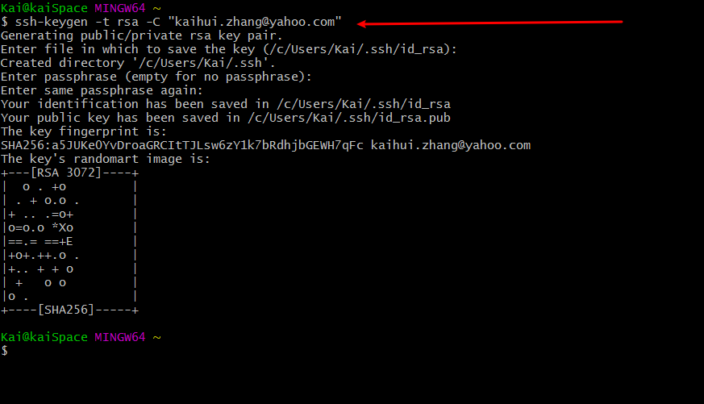
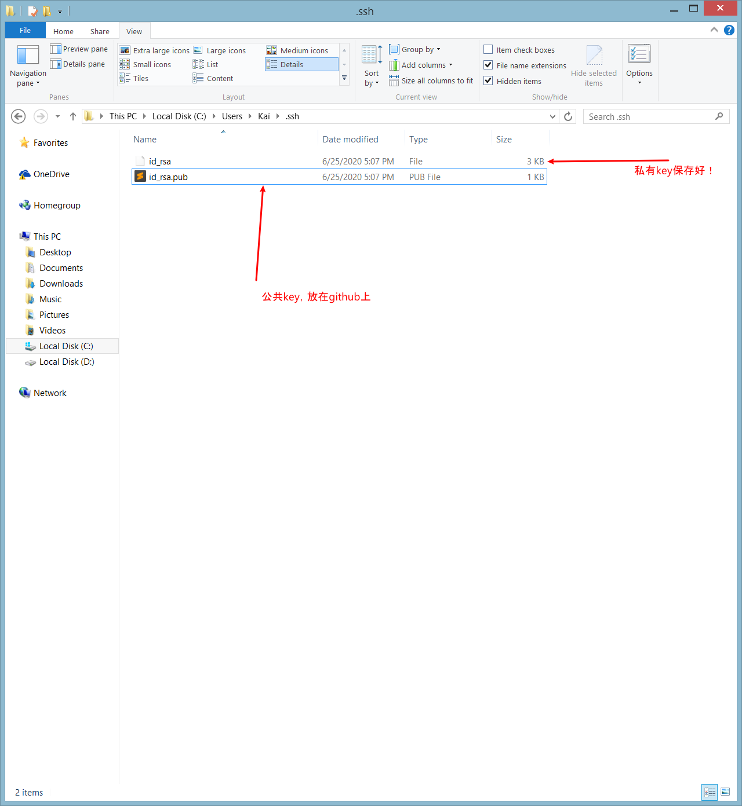
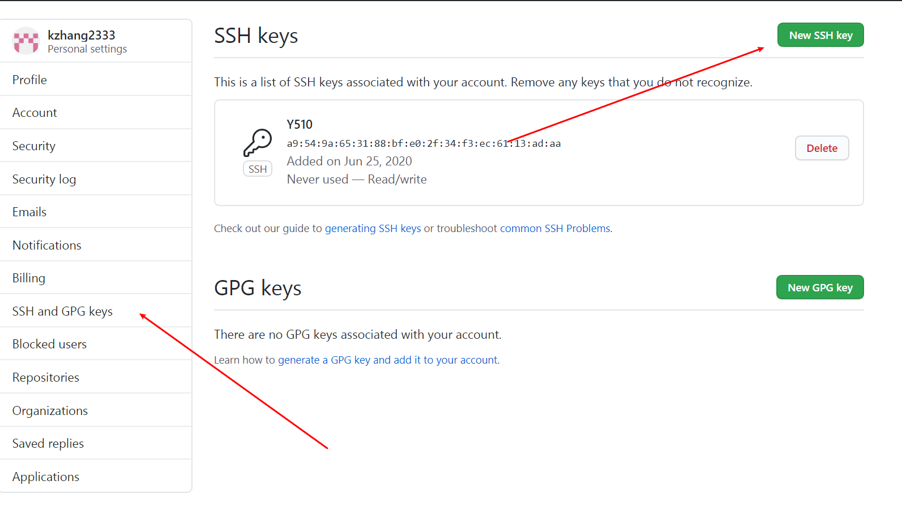
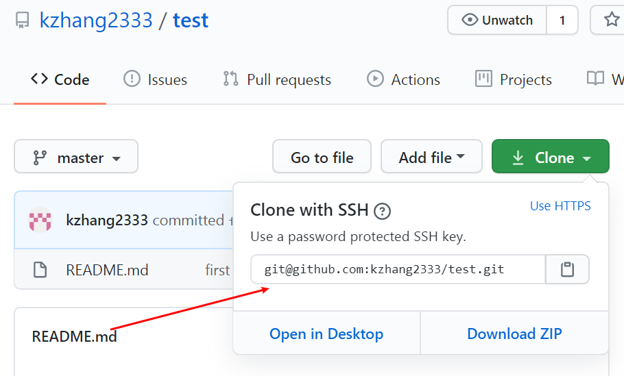
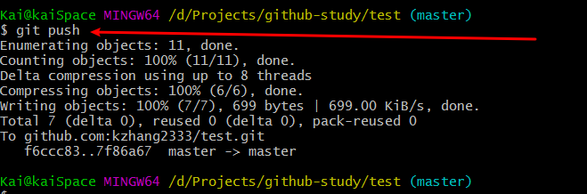

做码农，git和github是不可能避开的两个点，一个是先进的分布式版本控制系统，一个是大热的远程代码仓库，本文主要介绍了了git的工作原理，如何在本机使用git，以及如何使用github与他人协作，主要参考了一下两篇教程：

 [菜鸟教程](https://www.runoob.com/git/git-tutorial.html)

[廖雪峰的git教程](https://www.liaoxuefeng.com/wiki/896043488029600/896954117292416)

# 1. Git，GitHub，以及区别

Git: Git is a [free and open source](https://git-scm.com/about/free-and-open-source) distributed version control system designed to handle everything from small to very large projects with speed and efficiency.

Git就是**分布式**版本控制工具。好比window上的本地文件操作系统，提供了管理操作文件/文件夹的工具，只不过操作管理的对象是代码（项目）

GitHub：GitHub is a code hosting platform for version control and collaboration. It lets you and others work together on projects from anywhere.

GitHub就是云端代码库+操作其的接口。好比百度云，第一提供了云端仓库，第二提供了access云端仓库的工具

区别：

1. git在本地上运行，操作本地文件、项目；GitHub在远程运行，操作的云端文件、项目
2. git是一套工具；GitHub是一个仓库，同时提供一套工具
3. git体系下每个人的电脑上都存有一套完整项目，多人协作时只需互相推送修改，为了协作方便，往往也需要一个“中心位“电脑，GitHub就是这个中心位

# 2. Git

Git管理的是修改，并非文件

## 2.1 中心式 vs 分布式





## 安装

下载



## Git的工作方式：工作区、暂存区和版本库

- 工作区：电脑里的目录
- 暂存区：stage或者index。一般存放在.git目录下的index文件中，所以也称为索引 index
- 版本库：工作区中有一个不属于工作区的影藏目录.git，这是git的版本库



## 使用

- `git init`                                    将当前dir初始化为git管理区
- `git add file1.txt file2.txt`   将文件添加到暂存区
- `git commit -m "msg"`                 将暂存区文件全部添加到当前分支
- `git status`                                 (配合git diff使用更佳)
- `git log`                                      查看commit历史
- `git reset --hard commit_id`     将工作区恢复到某一commit
- `git reflog`                                 查看历史命令以利用reset方法回到未来
- `git checkout -- filename.txt`  将工作区制定文件恢复为上一次add或者commit时的版本
- `git checkout . `                          将所有工作区文件恢复为上一次add或者commit时的版本
- `git reset HEAD filename.txt`    将缓存区指定file unstage
- `git rm filename.txt`                  将缓存区的指定file删除
- `git checkout -- filename.txt`   将工作区中不小心误删的file还原


# 3. GitHub - Git的远程仓库

以上我们主要关注于如何在本机进行代码管理，但是Git是一个分布式的、多人协作的代码管理系统，如何与他人协作呢？

理论上在任何一个协作者的机器上都存在一个版本仓库，我们可以去任意一个人的机器上拿取他的代码。但是不能保证那个人一定在线，所以使用一个“中心”电脑专职存放代码，所有人都从“中心”拿取代码，并将自己的代码推送至“中心”。这就需要一个24小时运行的Git服务机，在现实生活中，这个“中心”机就是GitHub。

**GitHub就是我们的远程代码仓库！**

## 设置SSH Key

为什么GitHub需要SSH Key? 

> 因为GitHub需要识别出你推送的提交确实是你推送的，而不是别人冒充的，而Git支持SSH协议，所以，GitHub只要知道了你的公钥，就可以确认只有你自己才能推送。





将生成的Key添加到Github账户中



## 从GitHub克隆项目

在projects文件夹下打开git bash并，执行以下语句

```
git clone address 
```



## 从本地push到GitHub

```
git push
```




# 4. Git分支

```bash

# 列出所有本地分支
git branch

# 列出所有远程分支
git branch -r

# 新建一个分支，但依然停留在当前分支
git branch [branch-name]

# 新建一个分支，并切换到该分支
git checkout -b [branch]

# 合并指定分支到当前分支
$ git merge [branch]

# 删除分支
$ git branch -d [branch-name]

# 删除远程分支
$ git push origin --delete [branch-name]
$ git branch -dr [remote/branch]
```

