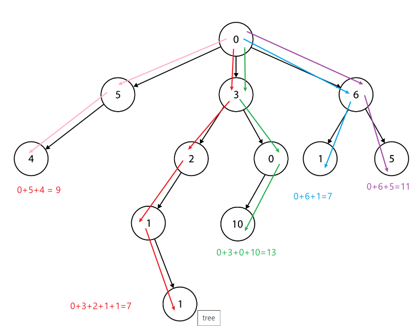

# Sales Path

The car manufacturer Honda holds their distribution system in the form of a tree (not necessarily binary). The root is the company itself, and every node in the tree represents a car distributor that receives cars from the parent node and ships them to its children nodes. The leaf nodes are car dealerships that sell cars direct to consumers. In addition, every node holds an integer that is the cost of shipping a car to it.

Take for example the tree below:



```java
/*
0 -- 5 -- 4 = 9
0 -- 3 -- 2 -- 1 -- 1 = 7
...
0 -- 6 -- 5 = 11
*/
```


A path from Honda’s factory to a car dealership, which is a path from the root to a leaf in the tree, is called a Sales Path. The cost of a Sales Path is the sum of the costs for every node in the path. For example, in the tree above one Sales Path is 0→3→0→10, and its cost is `13` (0+3+0+10).

Honda wishes to find the minimal Sales Path cost in its distribution tree. Given a node `rootNode`, write a function `getCheapestCost` that calculates the minimal Sales Path cost in the tree.

Implement your function in the most efficient manner and analyze its time and space complexities.

**Your function would return:**

`7` since it’s the minimal Sales Path cost (there are actually two Sales Paths in the tree whose cost is `7`: 0→6→1 and 0→3→2→1→1)

# Def

- leaf: a node without any children. Honda Dealership
- root: a node without parent. Honda Factory
- cost: cost of shipping to this node. Root has cost of 0 because no cost to ship to factory
- Sale path: a path from root to leaf. Add all cost of nodes of on path is total cost of the path

# Hint

- Can you find the minimal sales path in the example?
- Can you write down all possible paths in given example?
- What if you already know shortest path for all children nodes?

# Ans

1. DFS: pass on sum of cost, keep track of global minimal cost
2. recursion
   1. if we know minimal sales path for each child of root, we just compare them, then take the minimal one
   2. recursion rule: for each child, do getCheapestCost
   3. base case: rootNode has no child

# Complexity

Assume n is number of nodes for whole tree

1. Time: O(n) - we visit each node once and only once, each visit take O(1) time
2. space: O(height) = O(n) in worst case. Because we use recursion, recursion call stacks is height of the tree; in worst case, the tree is a single list, so the height is n. 

# followup 

1. Can you return all the sales paths with minimal cost in an array?
2. Can you also find longest and shortest path?

